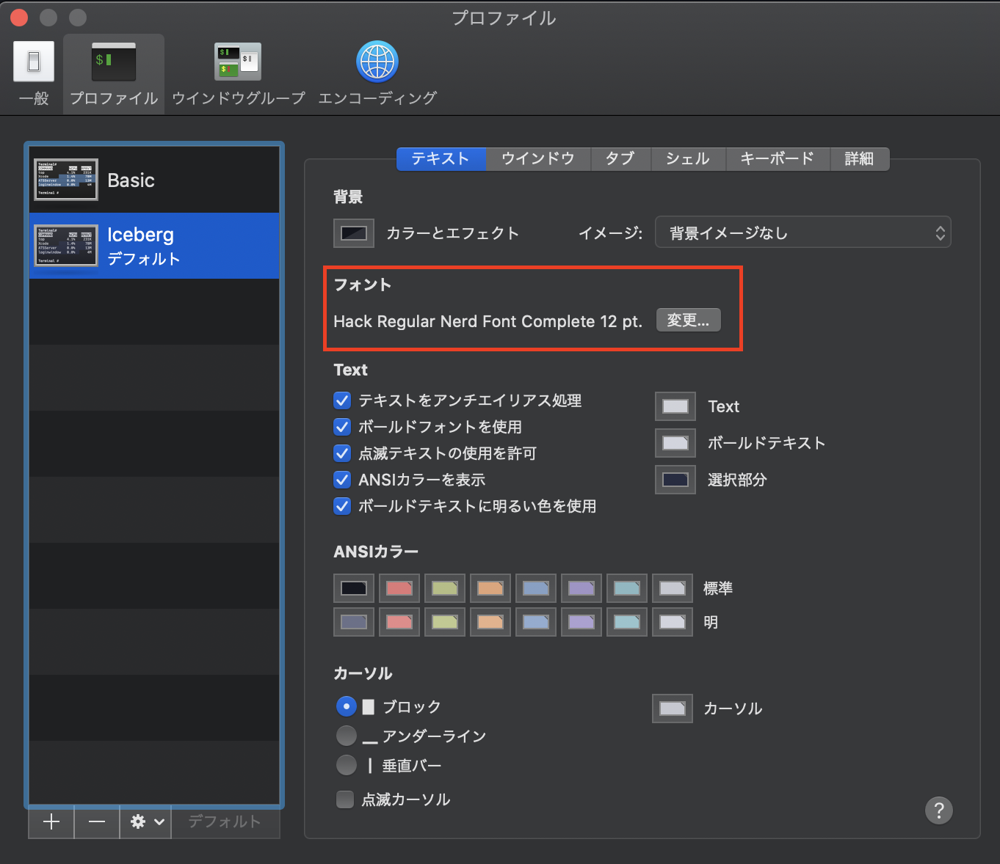

# Font

## 導入

以下、いずれかをインストールする。
その後の設定は共通しているので

iTerm2の場合はascii用のFontとそれ以外のFontで2種類設定できるらしいのでiTerm2を使う場合は両方インストールして設定する。

---

### Nerd Fonts

以下のコマンドでインストール

```shell
brew tap homebrew/cask-fonts
brew cask install font-hack-nerd-font
```

### Ricty

以下のコマンドでインストール

```shell
brew  tap sanemat/font
brew install ricty
```

Fontフォルダへの追加

```shell
cp -f /usr/local/opt/ricty/share/fonts/Ricty*.ttf ~/Library/Fonts/
fc-cache -vf
```

## 設定

---

### Terminal.app

Macデフォルトのターミナルアプリの場合は`環境設定>プロファイル>フォント`から以下のようにフォントを設定する。



## Hyper

Hyperの場合`.hyper.js`ファイルのフォント設定を以下のように編集 or 追記

```js
//　・・・　省略　・・・
fontFamily: 'Hack Nerd Font',
// ・・・　以下設定が続く　・・・
```

### 参考

- [vim-deviconsで格好いいvimを作ろう。](https://qiita.com/park-jh/items/4358d2d33a78ec0a2b5c)

- [【サルが書く】Hyperをアイコンで可愛くしよう](https://qiita.com/hajime_shoji/items/c5b239f30a742f0e98d7#%E3%82%A2%E3%82%A4%E3%82%B3%E3%83%B3%E3%82%92%E8%A1%A8%E7%A4%BA%E3%81%99%E3%82%8B%E3%81%9F%E3%82%81%E3%81%ABfont%E3%82%92%E5%85%A5%E3%82%8C%E3%82%8B)
